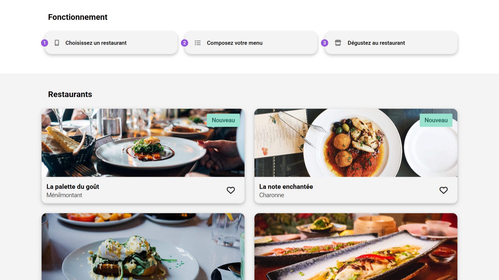

<div align="center">  
    <a href="https://ohmyfood-restaurant-vm.netlify.app
    " target="_blank">  
        
    </a>
    </br>  
    </br>  
  <h3 align="center">🍴 Ohmyfood - Projet Scolaire</h3>  
</div>

## <br /> 📌 Sommaire

&nbsp;&nbsp;&nbsp; 🎨 &nbsp; [**Introduction**](#introduction)<br />
&nbsp;&nbsp;&nbsp; 🛠️ &nbsp; [**Technologies**](#technologies)<br />
&nbsp;&nbsp;&nbsp; 🚀 &nbsp; [**Installation**](#installation)<br />

## <br /> <a name="introduction">🎨 Introduction</a>

Ce projet consiste en la création d'un site web présentant quatre restaurants gastronomiques, avec une esthétique moderne et minimaliste. Il comprend une page d'accueil répertoriant les restaurants ainsi qu'une page dédiée à chacun d'eux, affichant leur menu. Réalisé exclusivement en HTML et CSS, il est enrichi d'animations fluides pour offrir une expérience utilisateur élégante et immersive.

Pour plus d'informations, consultez le [dossier](/docs/).

## <br /> <a name="technologies">🛠️ Technologies</a>

### ✅ **Autorisé :**

- CSS (Flexbox, Grid, Animations, Media Queries)
- Sass (Mixins, Variables, Keyframes)
- PostCSS Autoprefixer

### ❌ **Interdit :**

- JavaScript
- CSS Frameworks (Bootstrap, Tailwind)
- Attribut style dans HTML

## <br /> <a name="installation">🚀 Installation</a>

### ✅ Pré-requis

🛠️ [**Git**](https://git-scm.com/) &nbsp;&nbsp;
🔧 [**Node.js**](https://nodejs.org/fr) &nbsp;&nbsp;
📦 [**npm**](https://www.npmjs.com/)

### 📥 Cloner le projet

```bash
git clone git@github.com:ValentinMadiot/ohmyfood-restaurant_ui.git
```

### ▶️ Lancer le projet

Utilisez Live Server pour un rechargement en temps réel.
