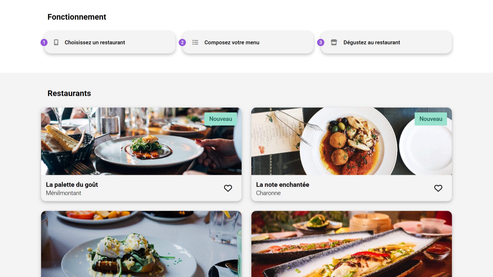

<div align="center">  
    <a href="https://ohmyfood-restaurant-vm.netlify.app
    " target="_blank">  
        
    </a>
    </br>  
    </br>  
  <h3 align="center">🍴 Ohmyfood - Projet Scolaire</h3>  
</div>

## <br /> 📌 Sommaire

&nbsp;&nbsp;&nbsp; 🎨 &nbsp; [**Introduction**](#introduction)<br />
&nbsp;&nbsp;&nbsp; 🛠️ &nbsp; [**Technologies**](#technologies)<br />
&nbsp;&nbsp;&nbsp; 🚀 &nbsp; [**Installation**](#installation)<br />

## <br /> <a name="introduction">🎨 Introduction</a>

Ce projet présente un site vitrine pour quatre restaurants gastronomiques fictifs. Il propose une page d’accueil listant les établissements et une page individuelle par restaurant avec un menu animé.

L’interface est conçue avec **HTML5**, **CSS3** et **Sass**, sans JavaScript, pour une expérience fluide et responsive, avec animations modernes et transitions élégantes.

> 📁 Pour plus d’informations, consulte le [dossier](/.docs/).

## <br /> <a name="technologies">🛠️ Technologies</a>

### ✅ **Autorisé :**

- HTML5 sémantique
- CSS (Flexbox, Grid, Animations, Media Queries)
- Sass (Mixins, Variables, Keyframes)
- PostCSS Autoprefixer

### ❌ **Interdit :**

- JavaScript
- Frameworks CSS (Bootstrap, Tailwind, etc)
- Style inline dans les balises HTML

## <br /> <a name="installation">🚀 Installation</a>

### ✅ Prérequis

- [Git](https://git-scm.com/) &nbsp;—&nbsp; Système de gestion de versions
- [Node.js](https://nodejs.org/fr) &nbsp;—&nbsp; Exécuteur local de scripts JavaScript
- [npm](https://www.npmjs.com/) &nbsp;—&nbsp; Gestionnaire de paquets JavaScript
- [Google Chrome](https://www.google.com/) &nbsp;—&nbsp; Navigateur moderne
- [Visual Studio Code](https://code.visualstudio.com/) &nbsp;—&nbsp; Éditeur de code
- [Live Server](https://marketplace.visualstudio.com/items?itemName=ritwickdey.LiveServer) &nbsp;—&nbsp; Extension VS Code

### 📥 Cloner le projet

```bash
git clone git@github.com:ValentinMadiot/ohmyfood-restaurant_ui.git
```

### ▶️ Lancer le projet

Il suffit d’ouvrir le fichier `index.html` dans un navigateur, ou d’utiliser l’extension **Live Server** sur VS Code pour un aperçu dynamique.
